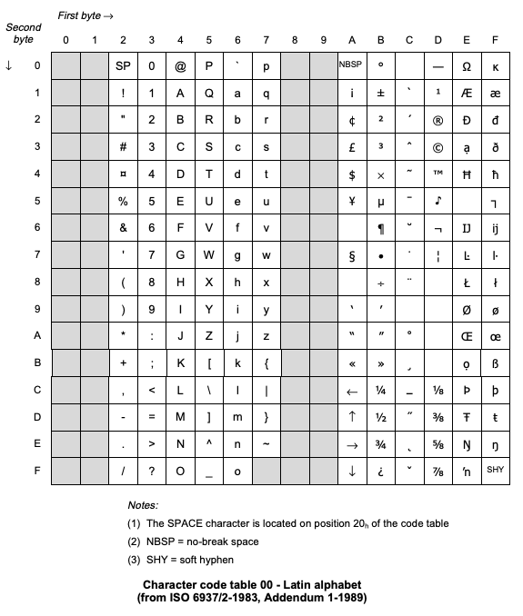

Java ISO-6937 and ISO-6937-2 Character Encoder/Decoder
=================

ISO 6937
--------

This charset is useful to decode [STL EBU](https://tech.ebu.ch/docs/tech/tech3264.pdf) cues.

To convert a String into bytes:

    $ myString.getBytes("ISO-6937");

To convert a set of bytes into a String:

    $ new String(myBytes, "ISO-6937");

Jar package
-----------

To create an executable jar using maven, run the following in the directory
where pom.xml is (Note: Maven must already be installed):

    $ mvn package

This will create the executable jar under target/charset-1.*.jar